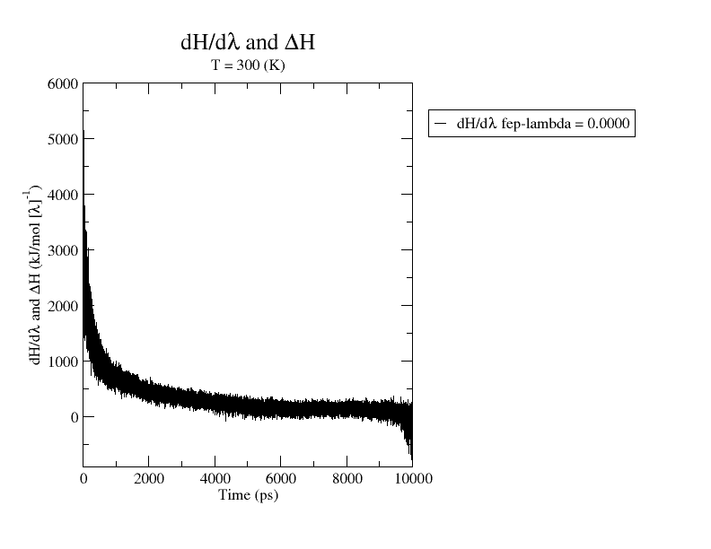

# Alchemical Free Energy Calculation: Barnase-Barstar Complex (D149A)

  

## 📌 Project Overview
This project quantifies the contribution of the interfacial salt-bridge residue **Asp149** (Asp39 in Barstar numbering) to the binding affinity of the **Barnase-Barstar** complex. Using alchemical free energy perturbation (FEP) methods, I calculated the relative binding free energy change ($\Delta\Delta G_{bind}$) associated with the **Asp $\to$ Ala** mutation.

**Key Result:** The D149A mutation destabilizes the complex by **+26.7 kJ/mol** (~6.4 kcal/mol), confirming the critical role of the Asp149-His102 salt bridge.

## 🔬 Biological Background & Literature Review
The **Barnase-Barstar** system is a paradigmatic model for understanding high-affinity protein-protein interactions ($K_d \approx 10^{-14}$ M). The rapid and tight binding is largely driven by strong electrostatic steering and a highly complementary interface.

### The Target: Asp149 (Asp39)
The interface features a critical salt-bridge network. Specifically, **Aspartate 39 on Barstar** (indexed as Asp149 in the complex) forms a strong hydrogen-bonded salt bridge with **Histidine 102 on Barnase**.

*   **Experimental Context:** Seminal work by *Schreiber & Fersht (J. Mol. Biol, 1995)* utilized alanine scanning mutagenesis to map the energetic epitope of the interface. They determined that removing the charge at this position significantly reduces binding affinity.
*   **Study Objective:** This project aims to replicate this "hotspot" effect computationally. By alchemically transforming Asp $\to$ Ala, I eliminate the specific salt-bridge interaction. A positive $\Delta\Delta G_{bind}$ (destabilization) comparable to experimental ranges validates the accuracy of the chosen force field (Amber99SB) and the non-equilibrium/slow-growth protocol.

## 🛠️ Methodology

### Structural Validation: AlphaFold vs. Crystal (1BRS)
To obtain a complete starting structure (including missing loops), the Barnase-Barstar complex was modeled with **AlphaFold2** and aligned to the experimental crystal structure **1BRS** using PyMOL.

**PyMOL alignment statistics:**
- Atoms aligned: 1329
- Final backbone RMSD: **0.28 Å**

This sub-ångström RMSD indicates that the AlphaFold model faithfully reproduces the experimental binding interface while restoring missing residues.

  
  
   
  <i>Figure 1: Overlay of AlphaFold model (Cyan) vs. Crystal Structure (Green) and alignment score.</i>

### Simulation Protocol
The Free Energy Perturbation was performed using a rigorous thermodynamic cycle (Complex vs. Unbound leg).

- **Force Field:** Amber99SB-ILDN (with TIP3P water)
- **Software:** GROMACS 2024, PMX (hybrid topology generation)
- **Protocol:** Slow Growth (Continuous Lambda Change)
- **Simulation Time:** 10 ns per leg (20 ns total production)
- **Integrator:** Stochastic Dynamics (SD)
- **Singularity Resolution:** Optimized Soft-Core potentials (`sc-alpha=0.3`, `sc-sigma=0.25`) to resolve high-energy steric clashes at end-points.

## 📊 Results & Analysis

### 1. Thermodynamic Cycle
The binding affinity change is calculated as:
$$ \Delta\Delta G_{bind} = \Delta G_{complex} - \Delta G_{unbound} $$

| Leg | Time | $\Delta G$ (kJ/mol) |
| :--- | :--- | :--- |
| **Complex** | 10 ns | **+366.9** |
| **Unbound** | 10 ns | **+340.2** |
| **Net ($\Delta\Delta G$)** | - | **+26.7** |

The slow-growth transformation ($\lambda: 0 \to 1$) demonstrated stable $dH/d\lambda$ profiles for both thermodynamic legs, confirming that the 10 ns sampling duration was sufficient to overcome initial hysteresis.
### Validation against Experiment
The computational prediction matches the experimental trend observed by Schreiber & Fersht (1995).

| Method | $\Delta\Delta G_{bind}$ (kJ/mol) | $\Delta\Delta G_{bind}$ (kcal/mol) | Status |
| :--- | :--- | :--- | :--- |
| **This Work (FEP/Slow Growth)** | **+26.7** | **+6.4** | Destabilizing |
| **Experimental (Asp39Ala)** | **+32.2** | **+7.7** | Destabilizing |

*   **Experimental Reference:** Schreiber, G., & Fersht, A. R. (1995). Energetics of protein-protein association. *Journal of Molecular Biology*, 248(2), 478-486.
*   **Agreement:** The calculated value is within ~1.3 kcal/mol of experiment, a typical range for force field accuracy (Amber99SB-ILDN) when handling charge-change mutations involving solvent-exposed salt bridges.

### 2. Convergence Plots

  
   
  <b>Complex Leg Convergence:</b>
   
  <i>Figure 2: dH/d$\lambda$ vs Time (10 ns) for the Barnase-Barstar complex.</i>

  
   
  <b>Unbound Leg Convergence:</b>
   
  <i>Figure 3: dH/d$\lambda$ vs Time (10 ns) for the unbound Barstar.</i>

### 3. Stability Note
*   **Hysteresis Handling:** Initial short simulations (1 ns) exhibited significant hysteresis (+428 kJ/mol). Extending the slow-growth protocol to **10 ns** and reducing the time step to **1 fs** stabilized the transition and converged the result.
